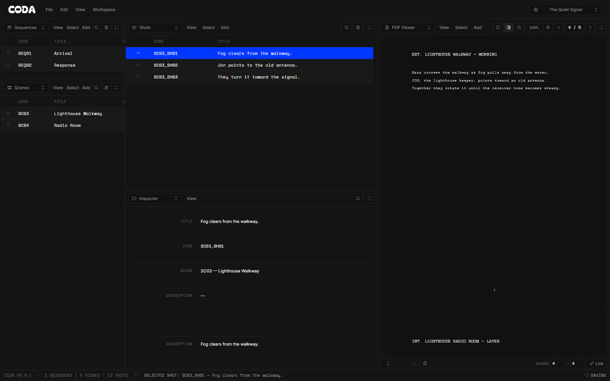
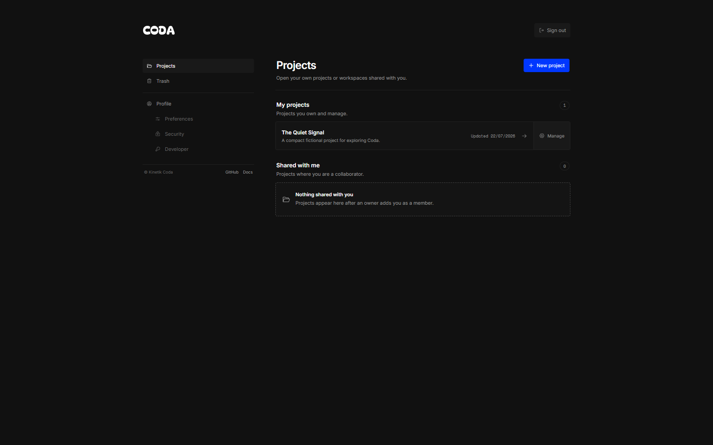

# Coda

**Turn source PDFs into structured breakdowns—on infrastructure you control.**

Coda is a self-hosted, desktop-first workspace that keeps a source PDF beside the data you derive from it. Configure one, two, or three hierarchy levels, name them in your team's language, add typed fields, and link each item back to the relevant source pages.

[Documentation](https://kinetik-gg.github.io/coda-docs/) · [Security](SECURITY.md) · [Changelog](CHANGELOG.md) · [MIT License](LICENSE)



Coda is deliberately focused on source breakdown. It is not a task manager, end-to-end production tracker, or media-review suite.

## What Coda does

- Configurable one-to-three-level breakdown hierarchies with custom names and display prefixes.
- Blank projects plus starter templates for movies, episodic work, and sequential art.
- Spreadsheet-style tables with search, typed filters, sorting, inline editing, column sizing, and saved manual ordering.
- Ordered custom fields for text, long text, numbers, booleans, dates, enums, and stored media.
- An integrated PDF workspace with page-range references attached to breakdown items.
- Project-scoped roles, granular permissions, invitations, comments, and activity history.
- Personal split-panel layouts with an owner-published project default.
- Recoverable trash, CSV and JSON exports, REST API keys, and a project-scoped MCP server.
- A self-hosted application backed by PostgreSQL and S3-compatible object storage.



## Install with Docker Compose

Requirements: Docker Engine 26+ with the Compose plugin.

```bash
git clone --branch v0.0.1 --depth 1 https://github.com/kinetik-gg/coda.git
cd coda
cp .env.example .env
```

Copy the `name@sha256:...` image reference from the successful release workflow's **Published container** summary into `CODA_IMAGE`. Replace every remaining `replace-with-...` value in `.env` with a unique random value. Keep the PostgreSQL password in `DATABASE_URL` synchronized with `POSTGRES_PASSWORD`; URL-encode it if it contains reserved characters.

```bash
docker compose up -d
docker compose ps
```

Open `http://localhost:3000` and complete the one-time owner setup using the `SETUP_TOKEN` from `.env`. The production stack does not create a default account.

The reference deployment starts:

- the attested `ghcr.io/kinetik-gg/coda@sha256:...` manifest selected in `CODA_IMAGE`
- PostgreSQL for durable application data
- MinIO with a bucket-scoped Coda service account

Only the Coda HTTP port and the object-download endpoint are published. The MinIO administration console is not exposed.

### Local image build

Use the development override to build the application image from the checkout:

```bash
docker compose -f compose.yaml -f compose.dev.yaml up -d --build
```

## Local development

Requirements: Node.js 24, pnpm 11, and Docker.

```bash
pnpm install --frozen-lockfile
copy .env.example .env
copy .env.local.example .env.local
# Replace every placeholder secret in both files before starting services.
docker compose -f compose.yaml -f compose.dev.yaml up -d postgres minio minio-init
pnpm db:deploy
pnpm dev
```

On macOS or Linux, use `cp` instead of `copy`. Fill `.env.local` with the same local service credentials used in `.env`, then open `http://localhost:5173`.

Useful checks:

```bash
pnpm format:check
pnpm quality
pnpm typecheck
pnpm test:unit
pnpm openapi:check
pnpm build
```

Pull requests also run integration tests against disposable PostgreSQL and MinIO services, a production-container smoke test, and the Playwright product loop.

## Templates

New projects can start blank or use an atomic server-side template:

| Template  | Default hierarchy       |
| --------- | ----------------------- |
| Movie     | Sequence → Scene → Shot |
| TV Series | Episode → Scene → Shot  |
| Comic     | Issue → Page → Panel    |

Templates add a small set of editable typed fields and can be created without uploading a PDF. A source document can be added later.

## API and MCP

Account settings can create separate, project-scoped REST API keys and MCP tokens. Tokens are shown once, stored only as hashes, limited to selected permissions, and can be expired or revoked independently.

The MCP server is a REST client rather than a database bypass. It exposes bounded project, schema, item, source, and activity tools while omitting administrative and destructive operations.

- [Documentation](https://kinetik-gg.github.io/coda-docs/)
- [External OpenAPI specification](docs/openapi.json)
- [MCP package](apps/mcp)

## Data and operations

Named Docker volumes hold PostgreSQL and MinIO data. Back up both volumes together to preserve database records and referenced objects consistently.

Before upgrading:

1. Record the currently running image digest and `CODA_IMAGE` reference.
2. Back up PostgreSQL and the object bucket.
3. Read [CHANGELOG.md](CHANGELOG.md) for migration notes.
4. Pull the new image and run `docker compose up -d`.
5. Confirm `/api/v1/health/ready` before removing the previous image.

To roll back, restore the matching database and object-store backup before starting the previous image digest. Do not run an older application against a database already migrated by a newer incompatible release.

## Current scope

Coda 0.0.1 is an early, desktop-first self-hosted release:

- Source documents are PDF-only, with one active source PDF per project.
- Breakdown items are created manually; OCR and automatic extraction are not included.
- Hierarchies are limited to one, two, or three levels.
- Collaboration uses authorized update notifications and authoritative refetching, not live cell co-editing or presence.
- Comments are flat rather than threaded.
- JSON exports contain storage metadata but not uploaded binaries.
- TLS, public routing, backups, and restore operations remain the operator's responsibility.

## Project information

- [Security policy](SECURITY.md)
- [Changelog](CHANGELOG.md)
- [License](LICENSE)

Coda is released under the MIT License. The name and logo identify this project and are not granted as trademarks by the software license.
