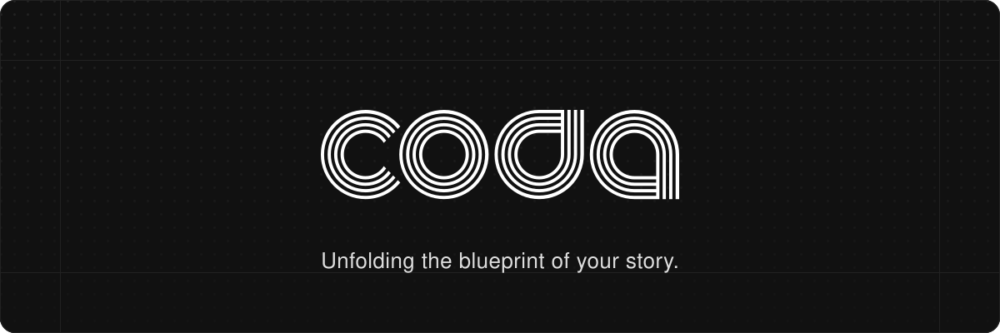

<p align="center">
  
</p>

<p align="center">
  <a href="https://github.com/kinetik-gg/coda/actions/workflows/ci.yml"></a>
  <a href="https://github.com/kinetik-gg/coda/releases/latest"></a>
  <a href="https://github.com/kinetik-gg/coda/pkgs/container/coda"></a>
  <a href="LICENSE"></a>
  <a href="https://github.com/kinetik-gg/coda/issues"></a>
  <a href="https://github.com/kinetik-gg/coda/stargazers"></a>
</p>

<p align="center">
  <a href="https://kinetik-gg.github.io/coda-docs/">Documentation</a> ·
  <a href="docs/docker.md">Deploy</a> ·
  <a href="docs/external-api.md">REST API</a> ·
  <a href="docs/mcp.md">MCP</a> ·
  <a href="AGENTS.md">Contributing</a> ·
  <a href="CHANGELOG.md">Changelog</a>
</p>

---

# Coda

**A self-hosted workspace for screen production: write the script together, break it down, and keep both in one shared Space.**

Coda is a self-hosted, desktop-first application. A **Space** is the container everything lives in: it holds screenplays and breakdowns, and its members and roles decide who can reach them. Share the Space once and every resource inside it is shared — you do not re-invite the same collaborators for each script and each breakdown.

Coda is focused on collaborative screenplay authoring and source breakdown. It is not a task manager, end-to-end production tracker, or media-review suite.

<table>
<tr>
<td width="50%" valign="top">

**If you are evaluating Coda**, read [What Coda does](#what-coda-does), then [Install](#install), review the [deployment support matrix](docs/deployment-support.md), or choose the [generic Docker](docs/docker.md), [Dokploy](docs/dokploy.md), [Portainer](docs/portainer.md), or [Coolify compatibility](docs/coolify.md) guide. [Current scope](#current-scope) is the honest list of what is and is not built yet.

</td>
<td width="50%" valign="top">

**If you are an agent or a contributor**, go to [Working in this repository](#working-in-this-repository). [`AGENTS.md`](AGENTS.md) is the binding contributor document; this README does not restate it.

</td>
</tr>
</table>

## What Coda does

### Spaces: the container everything lives in

A Space holds two kinds of resource today — **screenplays** and **breakdowns** — and every resource lives in exactly one Space. Every account owns a personal **Default Space**, which cannot be deleted or transferred. Resources created without an explicit Space land in their owner's Default.

- **One membership, many resources.** A Space member holds one Space role. That role carries Space-level permissions (`read_space`, `manage_space_settings`, `invite_members`, `manage_member_roles`, `manage_roles`, `create_resources`, `move_resources`, `delete_space`) plus a single **resource tier** — `viewer`, `contributor`, or `manager` — that projects onto every resource in the Space. A contributor can edit the scripts and the breakdown items; a manager can additionally change their settings, fields, and entity types.
- **A Space tier never escalates into ownership.** By construction, a Space role can never grant deleting a resource, re-sharing it, or reassigning its own membership roles. Those stay with the resource's own owner and roles.
- **Space access is additive, not a replacement.** Screenplays and breakdowns keep their own direct memberships, roles, and invitations. A person reaches a resource if the Space grants it _or_ they were invited to that resource directly, so moving a resource into a Space never takes access away from its existing collaborators.
- **Roles and invitations are per Space.** Space roles are named and editable, invitations go out by email against a hashed, expiring token, and memberships and roles both use optimistic version checks.
- **Spaces are not observable across tenants.** A non-member asking about a Space gets `404`, never `403`. REST API keys and MCP tokens are scoped to a single breakdown and are never treated as Space members.
- **Moving and handover.** A resource can be moved to another Space you can write to, behind a preflight that reports what the move would change, and a Space's ownership can be transferred to another member. The Default Space can be neither transferred nor deleted.

In the app, the sidebar carries a **Space switcher**: it picks the active Space, creates new Spaces, scopes the Screenplays and Breakdowns libraries to it, and opens that Space's management surface for members, roles, invitations, ownership, and deletion.

### Live collaborative screenwriting

Screenplays are edited live. The editor binds a Yjs CRDT document to CodeMirror over a Socket.IO gateway, so several people can type in the same script at once without a save conflict.

- **Presence and remote cursors.** Each participant gets a colour and a named chip in the editor chrome; remote selections and carets render inline in the text.
- **Durable server-side history.** The server keeps an append-only update log plus one compacted checkpoint per screenplay, and a background job folds the log into the checkpoint once it crosses a row or byte threshold.
- **Offline recovery.** Local edits are buffered in IndexedDB. On reconnect the client sends its Yjs state vector and the server returns only the updates it is missing, so a dropped connection or a closed tab replays instead of losing work.
- **Per-user undo.** Undo runs through a per-session Yjs undo manager, so undoing your own work never rolls back a collaborator's typing.
- **Comment threads anchored to the text.** A thread is anchored to a range of the script, quotes the text it was raised on, takes replies, and can be resolved. The anchors move with the document, so threads survive edits around them.
- **Authorization is re-checked, not cached forever.** Read-only members join and follow along, but their publish attempts are refused; when membership, roles, or ownership change, the server tells connected clients to re-join before trusting their access again.

### Screenplay authoring

- Fountain is the canonical source format, with contextual syntax highlighting, autosave, and lossless `.fountain` export.
- Import from Fountain, plain text, Final Draft XML (`.fdx`), HTML, Word (`.docx`), text-based PDF, or RTF; export to Fountain or `.fdx`. FDX, HTML, DOCX, PDF, and RTF are lossy interchanges — revisions, production metadata, custom styles, and embedded media are not preserved — and the app states that before you rely on them. The four non-Fountain interchange formats convert inside the bounded server-side adapter runtime rather than in the browser tab (`apps/api/src/imports/adapter-runtime`).
- PDF export, with a page-fidelity gate in continuous integration so exported pages keep matching the on-screen preview.
- A panel workspace with preview, outline, statistics, inventory, and comment panels, and server-synced per-user panel layouts.

### Breakdown workspace

- Configurable one-, two-, or three-level hierarchies with custom singular and plural names and display prefixes.
- Blank breakdowns plus server-side starter templates:

  | Template  | Default hierarchy       |
  | --------- | ----------------------- |
  | Movie     | Sequence → Scene → Shot |
  | TV Series | Episode → Scene → Shot  |
  | Comic     | Issue → Page → Panel    |

  Templates add a small set of editable typed fields and can be created without uploading a PDF. A source document can be added later.

- Spreadsheet-style tables with search, typed filters, sorting, inline editing, column sizing, and saved manual ordering.
- Ordered custom fields: text, long text, single- and multi-select enums, integers, floats, booleans, dates, and stored file, image, and video media.
- An integrated PDF workspace where breakdown items carry page-range references into the source document.
- Breakdown-scoped roles, granular permissions, invitations, per-item comments, and an activity history.
- Recoverable trash shared by breakdowns and screenplays, CSV and JSON exports, REST API keys, and a breakdown-scoped MCP server.
- A self-hosted application backed by PostgreSQL and S3-compatible object storage.

## Install

Coda's qualified deployment paths are generic Docker, Dokploy, and Portainer Docker Standalone.
[The deployment support matrix](docs/deployment-support.md) records their exact platform versions,
release boundary, and v0.0.7 lifecycle evidence. Coda can run on Coolify through the documented
manual Compose and environment adapters, but that is a compatibility statement rather than a
qualified lifecycle-support claim. See [Run Coda on Coolify](docs/coolify.md).

Coda is a stateless application: it holds no local state and stores everything in PostgreSQL and
S3-compatible object storage. Once running, the instance operates itself from the admin settings —
in-app backups (download, scheduled with retention, restore-at-setup, and automatic pre-upgrade
snapshots), a storage wizard with verified object migration, an update checker with an optional
upgrade ceremony, a diagnostic doctor page, and a token-gated `/metrics` endpoint.

### Install with Docker Compose

PostgreSQL and S3-compatible object storage are external services you bring — managed offerings or
self-hosted stacks with their own independent lifecycles. The canonical installation is therefore
the **app-only topology** (`compose.app.yaml`): Coda alone, pointed at stores you own. The bundled
full stack (`compose.yaml`) remains available as an **all-in-one quickstart** for evaluation, but it
is outside the qualified support boundary. `deploy/minio/` provides a standalone object-storage
stack when you want to self-host storage with a lifecycle separate from the application.

Requirements: Docker Engine 26+ with the Compose plugin. The dependency-free operator utilities
in release archives require Node.js 22+.

The [generic Docker deployment guide](docs/docker.md) defines the exact supported host and
topology boundary and the lifecycle checklist used to qualify it.

If Dokploy already manages your application workloads, follow the
[Dokploy deployment guide](docs/dokploy.md) to paste the same canonical app-only Compose file as
a Raw Compose source and use the platform's native domain and deployment lifecycle.

If Portainer already manages a local Docker Standalone environment, follow the
[Portainer deployment guide](docs/portainer.md) to paste the canonical app-only Compose file into a
Stack Web editor and connect your operator-managed HTTPS proxy to its private network.

Download the versioned deployment archive and matching checksum from the GitHub release,
verify the checksum and GitHub artifact attestations, then extract it. The bundle includes both
canonical topologies, the standalone object-storage stack, localhost overlays, environment
templates, and operations documentation with the release's exact attested image digest already
injected.

```bash
gh attestation verify coda-deployment-v0.0.7.tar.gz --repo kinetik-gg/coda
gh attestation verify coda-deployment-v0.0.7.sha256 --repo kinetik-gg/coda
sha256sum --check coda-deployment-v0.0.7.sha256
```

To install directly from a source checkout instead:

```bash
git clone --branch v0.0.7 --depth 1 https://github.com/kinetik-gg/coda.git
cd coda
cp .env.example .env
```

Copy the `name@sha256:...` image reference from the successful release workflow's **Published container** summary into `CODA_IMAGE`. Replace every remaining `replace-with-...` value in `.env` with a unique random value.

#### Canonical deployment (external PostgreSQL and object storage)

Use the app-only topology when PostgreSQL and S3-compatible storage are managed elsewhere. Set `DATABASE_URL`, `S3_ENDPOINT`, `S3_PUBLIC_ENDPOINT`, credentials, bucket, region, and `S3_FORCE_PATH_STYLE` in `.env`, then run:

```bash
docker compose -f compose.app.yaml -f compose.app.local.yaml up -d
docker compose -f compose.app.yaml -f compose.app.local.yaml ps
```

Open `http://localhost:3000` and complete the one-time owner setup using the `SETUP_TOKEN` from `.env`. The production stack does not create a default account.

Managed PostgreSQL deployments should require TLS in `DATABASE_URL`. Virtual-hosted S3 providers normally require `S3_FORCE_PATH_STYLE=false`. Provision the bucket and its CORS policy before starting Coda. See [deployment and operations](docs/operations.md) for the app-only `docker run` equivalent and reverse-proxy topology.

#### Self-hosted object storage

If you self-host S3-compatible storage rather than using a managed provider, `deploy/minio/` is a hardened, standalone MinIO stack you deploy as its own resource so storage keeps a lifecycle independent of the application—it survives application redeploys and can later be replaced by R2, S3, or Spaces. Copy `deploy/minio/minio.env.example` to `deploy/minio/minio.env`, replace every placeholder, then run:

```bash
docker compose -f deploy/minio/compose.yaml -f deploy/minio/compose.local.yaml up -d
```

The stack provisions the private bucket and a bucket-scoped service account; point the application's `S3_*` variables at it and back it up independently of Coda.

#### All-in-one quickstart (bundled full stack)

For evaluation, the bundled full stack runs Coda, PostgreSQL, and MinIO together in one project. Keep the PostgreSQL password in `DATABASE_URL` synchronized with `POSTGRES_PASSWORD`; URL-encode it if it contains reserved characters. Then run:

```bash
docker compose -f compose.yaml -f compose.local.yaml up -d
docker compose -f compose.yaml -f compose.local.yaml ps
```

Open `http://localhost:3000` and complete the one-time owner setup using the `SETUP_TOKEN` from `.env`. The production stack does not create a default account.

This reference deployment starts:

- the attested `ghcr.io/kinetik-gg/coda@sha256:...` manifest selected in `CODA_IMAGE`
- PostgreSQL for durable application data
- MinIO with a bucket-scoped Coda service account

`compose.yaml` is the platform-neutral full stack and publishes no host ports. The explicit `compose.local.yaml` override binds only Coda and the MinIO S3 API to localhost; it never exposes PostgreSQL or the MinIO administration console.

#### Local image build

Use the development override to build the application image from the checkout:

```bash
docker compose -f compose.yaml -f compose.dev.yaml up -d --build
```

## Working in this repository

Everything below is for someone — human or agent — about to change code here.
[`AGENTS.md`](AGENTS.md) is the binding contributor document: where code goes, the interface
type scale, and the verification expectation. This section is orientation, not a second rulebook.

### Quickstart from a clean checkout

Requirements: Node.js 22 or newer (continuous integration runs Node 24, and the container image
ships Node 26), pnpm 11.8.0 as pinned by `packageManager` in `package.json`, and Docker.

```bash
pnpm install --frozen-lockfile
cp .env.example .env
cp .env.local.example .env.local
# Replace every placeholder secret in both files before starting services.
docker compose -f compose.yaml -f compose.dev.yaml up -d postgres minio minio-init
pnpm db:generate
pnpm db:deploy
pnpm dev
```

On Windows, use `copy` instead of `cp`. Fill `.env.local` with the same local service credentials
used in `.env`, then open `http://localhost:5173`. `pnpm db:generate` and `pnpm db:deploy` read
`DATABASE_URL` from the process environment, so export the local one —
`postgresql://coda:<password>@127.0.0.1:5432/coda?schema=public` — when you run them.

The development web and API servers bind to `0.0.0.0`; for another device on the LAN, add
`DEV_ALLOWED_ORIGINS=http://<development-host-ip>:5173` to `.env.local` before starting Coda and
open that address from the device. Production rejects this development-only allowlist.

### Repository layout

| Path                     | Package               | What lives there                                                                   |
| ------------------------ | --------------------- | ---------------------------------------------------------------------------------- |
| `apps/web`               | `@coda/web`           | React and Vite client: the workspace shell, CodeMirror editor, and PDF surfaces.   |
| `apps/api`               | `@coda/api`           | NestJS API, Socket.IO collaboration gateway, Prisma schema, migrations, and seeds. |
| `apps/mcp`               | `@coda/mcp`           | The stdio MCP server, a REST client over one breakdown-scoped token.               |
| `packages/contracts`     | `@coda/contracts`     | Shared TypeScript and Zod request and response contracts.                          |
| `packages/fountain`      | `@coda/fountain`      | The Fountain parser and the screenplay interchange import and export layer.        |
| `packages/design-tokens` | `@coda/design-tokens` | Shared spacing, typography, and chrome tokens.                                     |
| `docs`                   | —                     | Public technical documentation that ships with the repository.                     |
| `scripts`                | —                     | The gates and generators the quality checks run.                                   |
| `.github`                | —                     | Continuous integration and release automation.                                     |

Run everything from the repository root with pnpm; scope to one package with
`pnpm --filter <package> <command>`.

### Authoritative commands

These are the commands the pipeline runs. If one of them fails locally it will fail in
continuous integration, and the reverse is intended to hold too.

| Command                 | What it establishes                                                             |
| ----------------------- | ------------------------------------------------------------------------------- |
| `pnpm format:check`     | Prettier formatting, including every Markdown file.                             |
| `pnpm quality`          | The full gate bundle listed below.                                              |
| `pnpm typecheck`        | TypeScript across every project reference.                                      |
| `pnpm test:unit`        | Unit suites against the enforced coverage threshold, plus the deployment suite. |
| `pnpm test:integration` | The API integration suite against disposable services.                          |
| `pnpm test:e2e`         | The browser product loop.                                                       |
| `pnpm openapi:check`    | That `docs/openapi.json` still matches the generated contract.                  |
| `pnpm build`            | Production builds for every package.                                            |

### What is enforced, and by which gate

The distinction matters. This repository has a documented history of guarantees that read as
enforced and were not, so each row below names the mechanism rather than an intention.

**Enforced by tooling.** A change that violates one of these fails a check.

| Constraint                                                                                                            | Gate                                                 |
| --------------------------------------------------------------------------------------------------------------------- | ---------------------------------------------------- |
| Formatting of all sources and Markdown                                                                                | `pnpm format:check`                                  |
| File, function, nesting, parameter, statement, and complexity limits                                                  | `pnpm lint`                                          |
| Copy-paste duplication budget                                                                                         | `pnpm quality:duplication`                           |
| No circular imports                                                                                                   | `pnpm quality:cycles`                                |
| Stylesheet size budget                                                                                                | `pnpm quality:css-size`                              |
| No pixel font sizes outside the token ladder                                                                          | `pnpm quality:font-tokens`                           |
| No database construct outside the portability seam                                                                    | `pnpm quality:db-portability` and `pnpm test:sqlite` |
| Runtime-profile portability                                                                                           | `pnpm quality:runtime-profile`                       |
| No appended table takes a foreign key, `citext`, or a shared enum onto a core table                                   | `pnpm quality:appended-table-fks`                    |
| The generated open-source credits manifest is current                                                                 | `pnpm credits:check`                                 |
| Documented scripts, env identifiers, repository paths, links, anchors, API routes, and MCP tool names all still exist | `pnpm quality:docs-drift`                            |
| The committed OpenAPI document matches the contracts                                                                  | `pnpm openapi:check`                                 |
| Exported screenplay pages match the on-screen preview                                                                 | `pnpm screenplay:pdf-fidelity`                       |
| Deployment topologies and platform adapters stay valid                                                                | `pnpm deployment:validate`                           |
| Unit coverage threshold                                                                                               | `pnpm test:unit`                                     |

**Carried by convention.** Nothing checks these; a reviewer does.

- **Whether documented prose is _true_.** `pnpm quality:docs-drift` verifies that referenced
  things exist. It never judges a sentence, so an accurate-looking but wrong explanation passes.
- **Where a change belongs** — the change locations in [`AGENTS.md`](AGENTS.md).
- **Commit message shape.** Conventional Commits are the house style, unenforced.
- **Spacing and chrome token usage.** Only font sizes are gated by
  `pnpm quality:font-tokens`; the rest of `packages/design-tokens/tokens.css` is convention.

One more mechanical fact worth knowing before you open a pull request: `.github/workflows/ci.yml`
classifies changed paths first. A change touching only `docs/`, Markdown, `LICENSE`, or issue
templates skips the code lanes deliberately — `pnpm format:check` is then the only gate that
actually runs. Run `pnpm quality` locally anyway when you edit a document that names a script, a
path, or an environment variable.

Pull requests that do touch code additionally run integration tests against a disposable
production topology on both the S3 and filesystem storage drivers, an empty-database migration
smoke test, a derived-SQLite portability lane, the Playwright product loop, a two-client
collaboration suite, and fresh-install plus upgrade deployment smoke tests.

The specific set of checks `main` requires before merging lives in GitHub's branch protection
settings, not in a workflow file. [`docs/ci-required-checks.md`](docs/ci-required-checks.md)
records that set as a committed manifest, so a rename that would silently detach a required check
shows up as a diff instead of a surprise.

### Durable artifacts

Any change touching the `.codabk` backup format, the database schema, or an encrypted
instance-configuration blob must follow [data compatibility](docs/data-compatibility.md):
versioned archive formats with the N / N-1 / N-2 import window, expand–contract migrations, and
schema-versioned config blobs. Ship the migration path in the same change.

## API and MCP

Account settings can create separate, breakdown-scoped REST API keys and MCP tokens. Tokens are shown once, stored only as hashes, limited to selected permissions, and can be expired or revoked independently. Because a credential is bound to one breakdown, it is never treated as a Space member.

The MCP server is a REST client rather than a database bypass. It exposes bounded breakdown, schema, item, source, and activity tools while omitting administrative and destructive operations.

- [Documentation](https://kinetik-gg.github.io/coda-docs/)
- [External REST API](docs/external-api.md) and the [OpenAPI specification](docs/openapi.json)
- [MCP server guide](docs/mcp.md) and the [MCP package](apps/mcp)
- [Reference for language models](docs/llm.md)

## Data and operations

Coda operates from the admin settings without shell access:

- **Backups.** Download a signed `.codabk` archive on demand, schedule recurring backups with rolling retention, restore a fresh instance from its first-run screen, and capture an automatic pre-upgrade snapshot before migrations apply. Every archive holds both the database and stored objects. Restoring on another instance requires that instance to carry the source's `CONFIG_ENCRYPTION_KEY`.
- **Storage.** A storage wizard validates, hot-swaps, and (with verified object migration) moves the object-storage backend at runtime.
- **Updates.** An update checker surfaces new releases, and an opt-in upgrade ceremony gates every redeploy behind a fresh backup, with a generic redeploy-webhook tier and an optional Coolify adapter.
- **Diagnostics.** A doctor page renders a sanitized instance report, and a token-gated Prometheus `/metrics` endpoint exposes request, storage, and update signals.

The [deployment and operations guide](docs/operations.md) documents each of these, the full environment contract, and the operator-side backup/restore procedures. [Data compatibility](docs/data-compatibility.md) is the standing policy for backup-format versions, database migrations, and config blobs. Do not run an older application against a database already migrated by a newer incompatible release.

## Current scope

Coda is an early, desktop-first self-hosted product:

- Spaces hold breakdowns and screenplays, and nothing else yet. Each resource lives in exactly one Space.
- Every account owns a personal Default Space. The interface creates, switches between, and manages Spaces, and invitations share only the Space or resource they target.
- A Space role grants working access to the resources inside a Space; it never grants deleting a resource, re-sharing it, or reassigning its membership roles.
- Live co-editing, presence, per-user undo, and range-anchored comment threads apply to **screenplays**. The breakdown workspace still coordinates through authorized change notifications and authoritative refetching rather than live cell co-editing, and breakdown item comments are flat rather than threaded.
- Screenplays use Fountain as their canonical source. Fountain round-trips losslessly; FDX import and export are deliberately lossy; plain text imports as forced action. Fade In, Celtx, Movie Magic, and Highland project containers cannot be read — export an interchange format from those applications first.
- Breakdown source documents are PDF-only, with one active source PDF per breakdown.
- Breakdown items are created manually; OCR and automatic extraction are not included.
- Hierarchies are limited to one, two, or three levels.
- JSON exports contain storage metadata but not uploaded binaries.
- TLS and public routing remain the operator's responsibility; backups and restore are available in-app.

## Repository information

- [Contributor guide](AGENTS.md)
- [Security policy](SECURITY.md)
- [Changelog](CHANGELOG.md)
- [License](LICENSE)

Coda is released under the MIT License. The name and logo identify this project and are not granted as trademarks by the software license.

Status badges above are rendered by [shieldcn](https://shieldcn.dev) (MIT).
